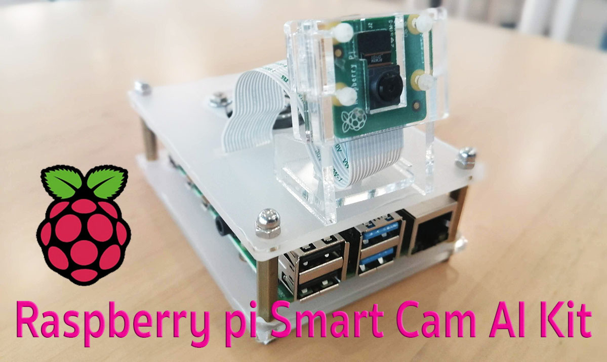

# Smartcam

Last update : 03/16/2020

# Introduction

Smartcam is a Open-Source for security camera using computer vision Tensorflow lite or intel neural compute stick for object detection and tracking

# Hardware
1. Rapberry pi 3B+ or 4
2. Camera (USB ,RTSP)
3. Intel neural compute stick ( option )

# Requirements library and framework
1. Flask Framework
2. OpenCv 4.0.0
3. Admin lite 2.4.3
4. line notify 
5. APScheduler
6. OpenVino 2020 R1 (raspberry
7. Tensorflow Lite
